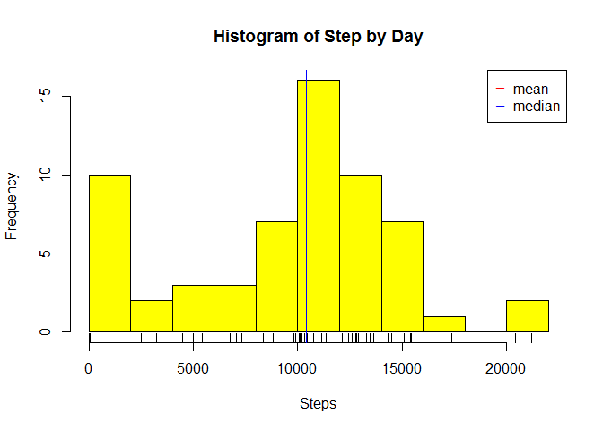
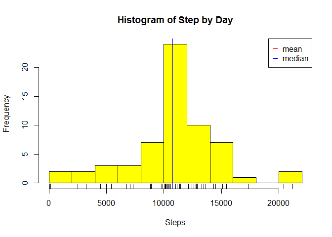
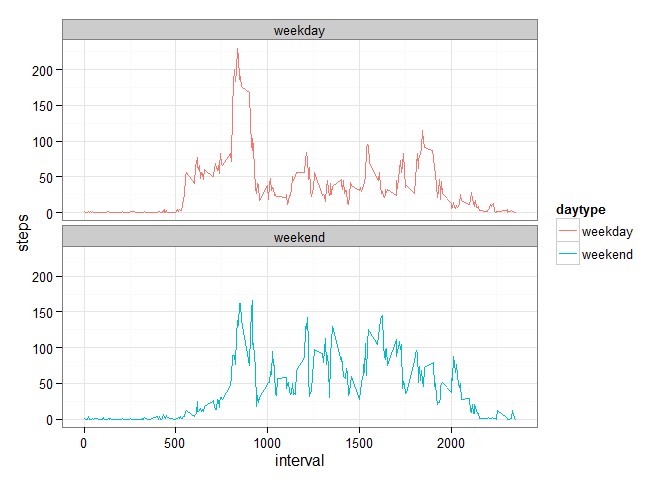

# Reproducible Research: Peer Assessment 1
Giuliano Sposito  
May, 2015  


## Loading and preprocessing the data

### Setup and Data preparation

We assume that the script starts only with the *activity.zip* file. This chunk of code unzip the data to start the data load and preparation.


```r
## check if data folder exists
if(!file.exists("./data/activity.csv")) {
  
  ## if not-> download and unzip data files
  dir.create("./data")
  unzip("activity.zip", exdir="./data")
}
```

Also, we will use **dplyr** package to summarise the data.


```r
## loading dplyr lib to summarise the dagta
library(dplyr)
```

```
## Warning: package 'dplyr' was built under R version 3.1.3
```

```
## 
## Attaching package: 'dplyr'
## 
## The following object is masked from 'package:stats':
## 
##     filter
## 
## The following objects are masked from 'package:base':
## 
##     intersect, setdiff, setequal, union
```

### Loading the data 

Just load the data and convert the date column


```r
## reading the data file
dt <- read.csv("./data/activity.csv", header = T, colClasses=c("numeric","character","numeric"))
```

## What is mean total number of steps taken per day?

We now will plot the histogram of steps by the and calculate the mean and median.


```r
## group by date
stepByDay <- dt %>% select(date,steps) %>%
              group_by(date) %>% 
              summarise(steps=sum(steps,na.rm=T))

## calculates the mean and median
step_mean <- mean(stepByDay$steps, na.rm=T)
step_median <- median(stepByDay$steps, na.rm=T)

## plot an histogram and also sinalize the mean and median in the chart
hist(stepByDay$steps,breaks = 15,col="yellow", main="Histogram of Step by Day", xlab="Steps")
rug(stepByDay$steps)
abline(v=step_mean, col="red")
abline(v=step_median, col="blue")
legend("topright", pch = "_", col = c("red", "blue"), legend = c("mean","median"))
```

 

The mean the total number of steps taken per day is **9354.23** and the median is **10395.00**.

## What is the average daily activity pattern?

We will group the data around the 5 min interval and summarize by average, also we will check which 5 min interval has the max steps average.


```r
## group and summarise by 5 min interval
stepsBy5min <- dt %>% 
                group_by(interval) %>% 
                summarise(steps=mean(steps,na.rm=T))
with(stepsBy5min, plot(interval,steps, type="l"))
```

 

```r
## check which has the max steps average
max5minIdx <- which.max(stepsBy5min$steps)
max5minInterval <- stepsBy5min[max5minIdx,]$interval
max5minSteps <- stepsBy5min[max5minIdx,]$steps
```

The 5 min interval which the max average steps is **835** with **206.2** steps average.


## Imputing missing values

### Calculate and report the total number of missing values

Counting the number of missing values.


```r
nrow(dt[is.na(dt$steps),])
```

```
## [1] 2304
```

### Devise a strategy for filling in all of the missing values in the dataset.

We will replace the missing values by the 5 min interval global average. Seeing the dataset attributes before the filling:


```r
summary(dt)
```

```
##      steps            date              interval     
##  Min.   :  0.00   Length:17568       Min.   :   0.0  
##  1st Qu.:  0.00   Class :character   1st Qu.: 588.8  
##  Median :  0.00   Mode  :character   Median :1177.5  
##  Mean   : 37.38                      Mean   :1177.5  
##  3rd Qu.: 12.00                      3rd Qu.:1766.2  
##  Max.   :806.00                      Max.   :2355.0  
##  NA's   :2304
```

Filling the NA's value.


```r
dt[is.na(dt$steps),]$steps <- stepsBy5min[stepsBy5min$interval==dt$interval]$steps
```

Seeing the dataset attributes after filling:


```r
summary(dt)
```

```
##      steps            date              interval     
##  Min.   :  0.00   Length:17568       Min.   :   0.0  
##  1st Qu.:  0.00   Class :character   1st Qu.: 588.8  
##  Median :  0.00   Mode  :character   Median :1177.5  
##  Mean   : 37.38                      Mean   :1177.5  
##  3rd Qu.: 27.00                      3rd Qu.:1766.2  
##  Max.   :806.00                      Max.   :2355.0
```

### Histogram, Mean and Median of filled dataset

Make a histogram of the total number of steps taken each day and Calculate and report the mean and median total number of steps taken per day.


```r
## group by date
stepByDay <- dt %>% select(date,steps) %>%
              group_by(date) %>% 
              summarise(steps=sum(steps,na.rm=T))

## calculates the mean and median
step_mean <- mean(stepByDay$steps, na.rm=T)
step_median <- median(stepByDay$steps, na.rm=T)

## plot an histogram and also sinalize the mean and median in the chart
hist(stepByDay$steps,breaks = 15,col="yellow", main="Histogram of Step by Day", xlab="Steps")
rug(stepByDay$steps)
abline(v=step_mean, col="red")
abline(v=step_median, col="blue")
legend("topright", pch = "_", col = c("red", "blue"), legend = c("mean","median"))
```

 

The mean the total number of steps taken per day is **10766.19** and the median is **10766.19**. 

***Do these values differ from the estimates from the first part of the assignment? What is the impact of imputing missing data on the estimates of the total daily number of steps?***

Now the mean and median has the same values. (Should?)

## Are there differences in activity patterns between weekdays and weekends?

First we classify the row data by weekday/weekend adding a new collumn "daytype"


```r
dt$daytype <- factor(strptime(dt$date,"%Y-%m-%d")$wday %in% c(6,0),labels=c("weekday","weekend"))
```

And after that wee plot the differences 5 min in average steps by interval between weekdays and weekend;


```r
stepsByDayType <- dt %>% 
              group_by(interval,daytype) %>% 
              summarise(steps=mean(steps,na.rm=T))
library(ggplot2)
```

```
## Warning: package 'ggplot2' was built under R version 3.1.3
```

```r
g <- ggplot(stepsByDayType, aes(x=interval, y=steps, color=daytype))
p <- g + geom_line() + facet_wrap(~daytype,nrow=2) + theme_bw()
p
```

 
